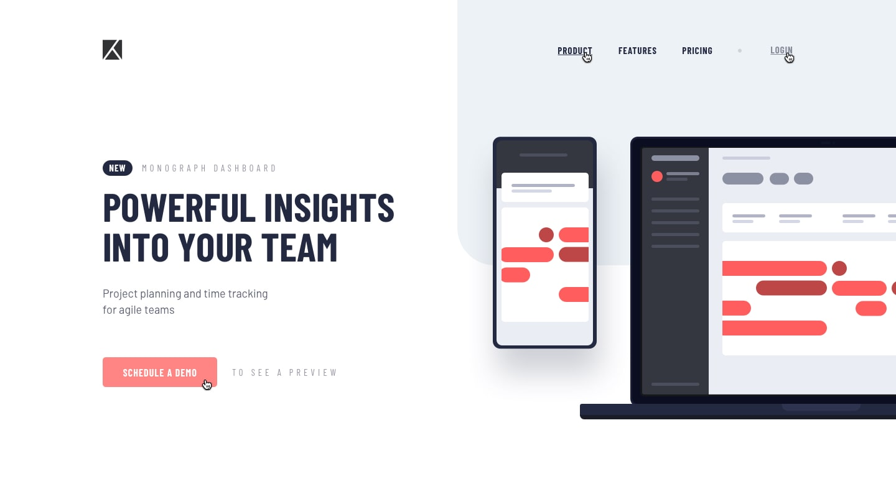
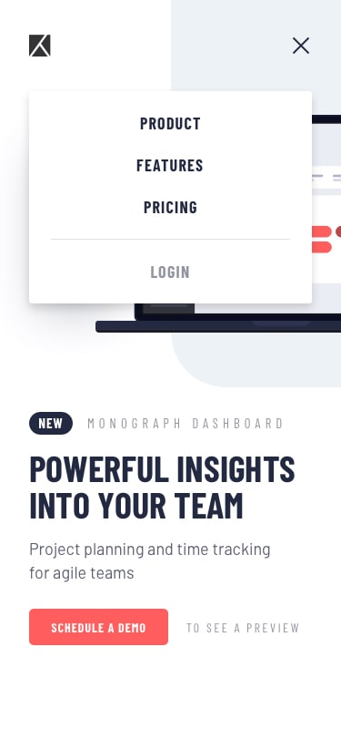

# Frontend Mentor - Project tracking intro component

## Welcome! 👋

Thanks for checking out my submission for the Frontend Mentor - Project tracking intro component Challenge.

## The challenge

The challenge is to build out this intro component and get it looking as close to the design as possible.

Users should be able to:

- View the optimal layout for the site depending on their device's screen size
- See hover states for all interactive elements on the page
- Create the background shape using code

## Design Previews

**Desktop Design Preview**

**Active States Preview**

**Mobile Design Preview**

**Mobile Navigation Design Preview**

